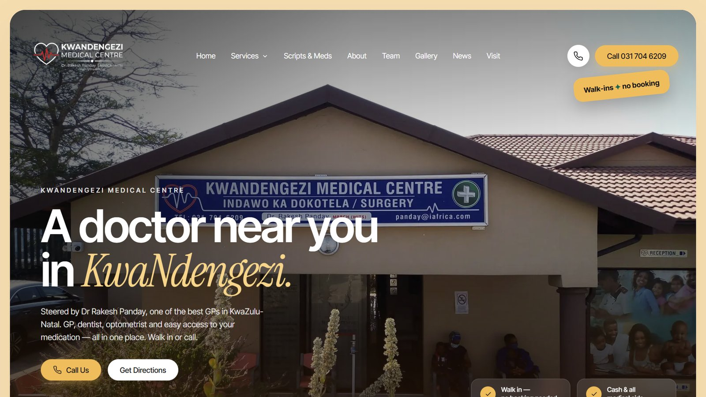

# Kwandengezi Medical Centre

Website and patient form builder for Dr Rakesh Panday's family practice in Kwandengezi, Durban.

The practice has been running since the early 2000s with no real online presence beyond a Facebook
page. Two things were needed: somewhere for people searching "doctor near Kwandengezi" to land,
and a way to collect patient information before the patient is standing at the desk.

## The site

Next.js 14 App Router. Pages for the practice, services, the team, the on-site dentist,
optometrist and pharmacy, a gallery, announcements, and a map.

Local SEO is deliberate rather than decorative: pages target high-intent search terms
(the condition or service plus the suburb), and `sitemap.ts` and `robots.ts` are generated rather
than static, so a new service page is indexable the moment it exists.

## The form builder

A Typeform-style patient form system, built because the alternative was paying per response for
something the practice fills in a few hundred times a month.

**Patients** fill forms at `/f/<slug>`. One question at a time, keyboard-friendly, saves a draft in
the browser, works on any phone. No account needed.

**Staff** build forms at `/admin` — create a form, add any of 12 question types, publish, share the
link over SMS, WhatsApp or a QR code, then read and export responses.

## Privacy, because it's health data

POPIA applies here, so a few things are non-negotiable and are enforced in code:

- Raw IP addresses are never stored. Only an irreversible hash, used for rate-limiting.
- The staff area is password-gated and CSV export is auth-gated.
- Rotating `AUTH_SECRET` signs everyone out and resets submitter hashes.
- Responses are meant to be purged on a schedule, not kept forever. The README documents the
  retention query rather than leaving it to memory.

**Spam protection**: a honeypot field plus a minimum elapsed-time check (bots get a fake success
so they don't retry), and the same IP hash is limited to five submissions per form per hour.

## Known limits (v1)

Stated plainly because a client should know what they have:

- One shared staff password. No individual logins or roles yet.
- No brute-force limiter on the admin login — the mitigation is a long password.
- No email notification on a new response. Someone has to open the dashboard.

## Stack

Next.js 14, React 18, TypeScript, Neon Postgres over HTTP, Framer Motion, Leaflet for the map.
Deployed on Vercel.

## Status

Live. Client work — repo is private.

---

Source is private — this repo is the write-up. [Shaun Madondo](https://github.com/TheC0deJunkie) · Durban, KwaZulu-Natal.
